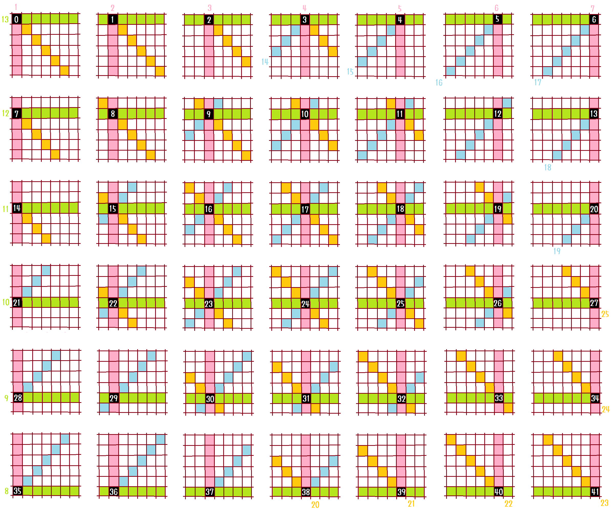
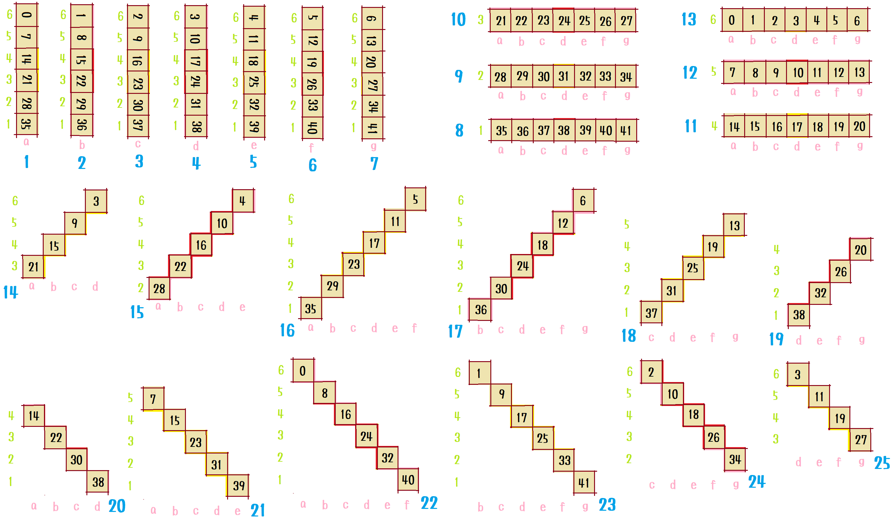
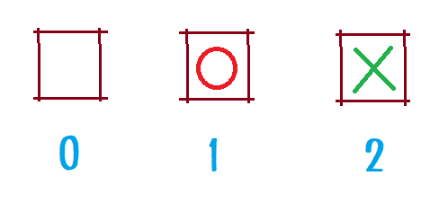
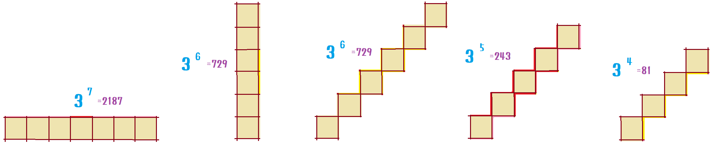

# kifuwarabe-connect-four

WIP

## Run

```shell
cargo run
```

## Evaluation design

### Elemental features

elemental features:  

  

features square:  

  

square value:  

  

feature size:  

  

## How to program a connect-four game?

During development, you may need to reproduce the behavior of your computer.  
It is difficult to compare the behavior. Instead, it is useful to get the logs and compare the logs.  
**But logger's difficult to make, so use library.**  

* [x] Step 1. Use logger library.
  * [x] Use casual_logger library at 'Cargo.toml', 'main.rs'.
  * [x] Create the 'log.rs' file.
    * [x] Extend the logger.

Let's proceed with development while testing.  

* [ ] Step 2. Create the `test.rs` file.
  * Add little by little as you progress through the steps.  

The first thing you have to create is your motive.  
It is important to start with the appearance.  

* [x] Step 3. Create the 'look_and_model.rs' file.
  * [x] Piece - "O", "X".
  * [x] Game result - Win/Draw/Lose.
  * [x] Position - It's the board.
  * [x] Search - Computer player search info.

If you want to play immediately, you have the talent of a game creator.  
Being able to control your position means being able to play.  

* [x] Step 4. Create the 'position.rs' file.
  * [x] do_move
  * [x] undo_move
  * [x] opponent

Let's enter commands into the computer. Create a command line parser.  

* [x] Step 5. Create the 'command_line_seek.rs' file.
  * [x] Starts with.
  * [x] Go next to.
  * [x] Rest.

People who are looking for something 10 minutes a day are looking for something for a week in a year.  
Before creating the game itself, let's first create the replay function. Let's get it for a week.  

* [x] Step 6. Create the 'uxi_protocol.rs' file.
  * [x] Do. (Before 'From XFEN') Excludes legal moves and winning/losing decisions.
  * [x] To XFEN.
  * [x] From XFEN.
  * [x] Undo.

Let's make a principal command.  

* [x] Step 7. Create the 'engine.rs' file. Command line.
  * [x] position.
  * [x] pos.
  * [x] do.
  * [x] undo.
  * [x] uxi.
  * [x] xfen.
* [x] Step 8. 'src/main.rs' or 'examples/main.rs'.

Before you make a computer player, let's judge the outcome. And let's test.  

* [x] Step 9. 'win_lose_judgment.rs'
  * [x] Win.
  * [x] Draw - Not win, not lose, can not play.
  * [x] Lose. - Not win is lose.

Before creating a computer player, let's create a mechanism to measure performance.  

* [x] Step 10. 'performance_measurement.rs'
  * [x] Seconds. - Stopwatch.
  * [x] Node per second.

Let's make a computer player.  

* [x] Step 11. 'computer_player/search.rs'
  * [x] Search.
* [x] Step 12. 'computer_player/evaluation.rs'
  * [x] Evaluation - None.
* [ ] 'main.py'
  * [ ] Create "go" command.
* [ ] Remeve all 'TODO' tasks. Examples: '// TODO Write a code here.'

Finally, let's larning a computer thinking.

* [ ] Step 13. `computer_player/learn.rs`
